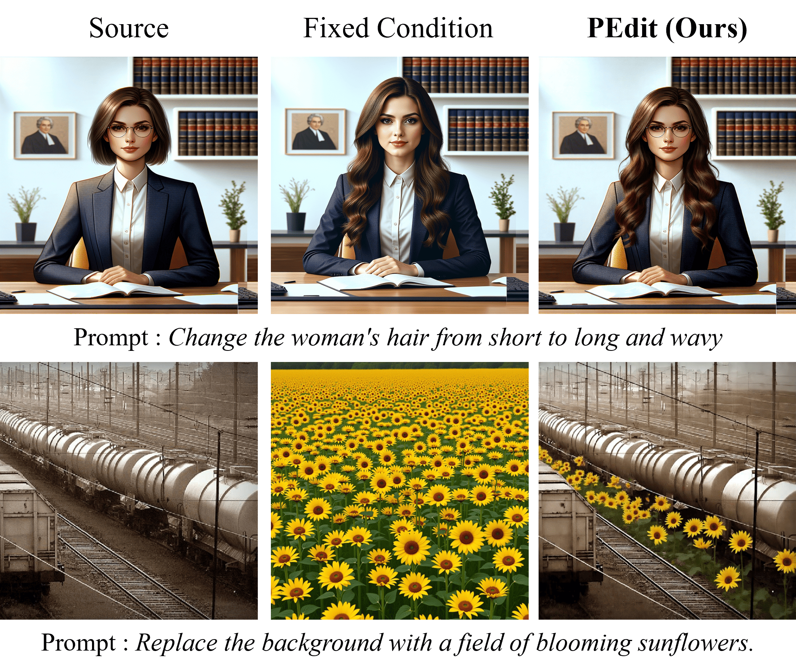
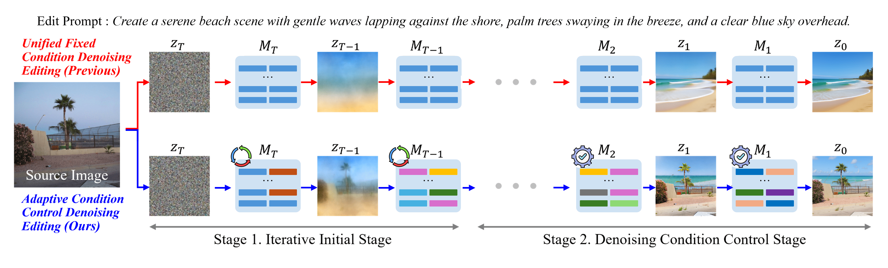

# PEdit: Pareto-Guided Image Editing via Dynamic Latent Trajectory Control

> CVPR 2026  
> Official implementation of **PEdit**

---

## ✨ Teaser



---

## 🔥 Overview

Text instruction-based image editing requires balancing two conflicting objectives:

- **Semantic Alignment** (following the text instruction)
- **Structural Preservation** (maintaining the source image)

Existing methods often fail to maintain this balance, resulting in:
- over-editing (text-dominant)
- structure collapse (image-dominant)

👉 We propose **PEdit**, a diffusion-based image editing framework that formulates editing as a **multi-objective optimization problem** and guides the latent trajectory toward the **Pareto-optimal region**.

---

## 🧠 Key Idea

- Treat editing as a **Pareto optimization problem**
- Dynamically balance:
  - text guidance
  - image structure
- Control editing via **latent trajectory + condition scaling**

---

## ⚙️ Method Overview



### Two-stage Pipeline

**Stage 1: Pareto Initialization**
- Optimize condition scaling in early timesteps
- Find balanced latent

**Stage 2: Editing Pathway Control**
- Maintain balance across denoising steps
- Prevent collapse toward text-only or image-only

---

## 🧪 Key Metrics

- **TCR (Text Cross-Attention Ratio)**  
  → measures semantic dominance

- **SSNR (Structural Signal-to-Noise Ratio)**  
  → measures structure preservation

---

## 🖼️ Results


### Qualitative Observations

- Strong semantic alignment (better than Kontext, QwenEdit)
- Preserves structure without over-editing (better than ReFlex)
- Works for both:
  - Local edits
  - Global edits

---

## 📊 Quantitative Results

PEdit achieves:

- **CLIP-T ↑** (better semantic alignment)
- **CLIP-I / DINO-I ↑** (better structure preservation)
- **L2 distance ↓**
- **FID ↓**

👉 Consistently outperforms prior methods across benchmarks

---

## 👤 User Study

- Highest preference in:
  - Edit Fidelity
  - Visual Quality
- Competitive in:
  - Structure Consistency

---

## 🔁 Multi-Edit Capability

- Existing methods fail in multi-region editing
- **PEdit enables precise region-wise control**

---

## 📊 Benchmarks

- **HQ-Edit** (synthetic)
- **Emu-Edit Bench** (real-world)

---

## ⚡ Advantages

- No inversion required → faster inference
- No step-wise optimization
- Stable across diverse editing tasks
- Plug-and-play with DiT models

---

## 🚀 Installation

```bash
git clone https://github.com/yourname/pedit
cd pedit
pip install -r requirements.txt
